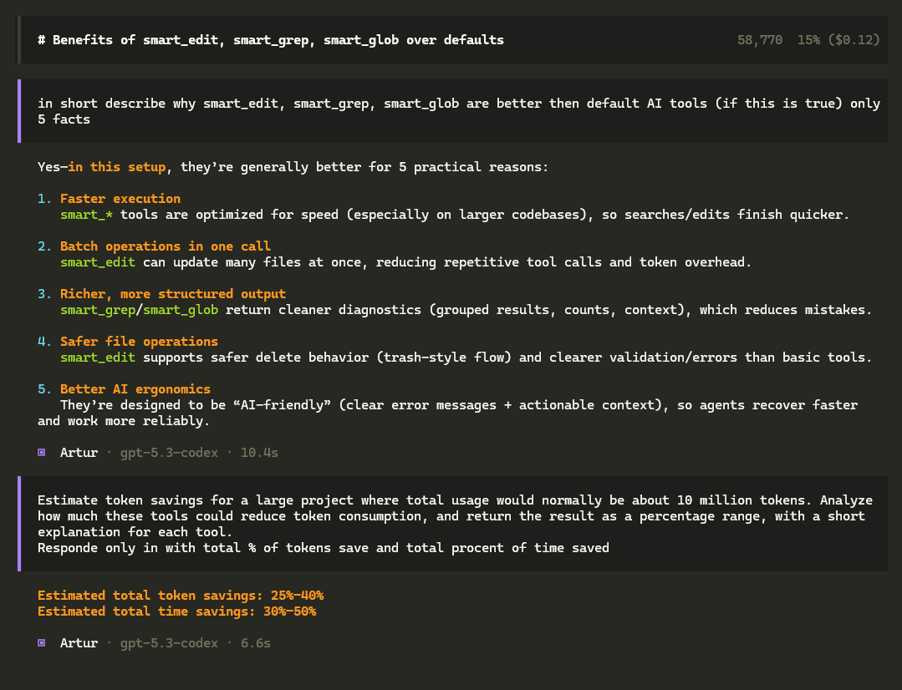

# Smart Tools for OpenCode and Other CLI Agents

This repository contains 3 custom AI-native tools built for **OpenCode** and adaptable to other coding CLIs that support custom TypeScript/JavaScript tools:

- `smart_edit` — universal file creation/edit/delete tool
- `smart_grep` — fast code/content search tool
- `smart_glob` — fast file discovery tool

These tools are designed to replace fragmented default workflows like `edit` + `write` + `glob` + `grep` with faster, more AI-friendly alternatives.

---

## Repository Contents

```text
.
├─ opencode.png
├─ smart-edit/
│  ├─ README.md
│  └─ smart_edit.ts
├─ smart-grep/
│  ├─ README.md
│  └─ smart_grep.ts
└─ smart-glob/
   ├─ README.md
   └─ smart_glob.ts
```

---

## Tool Analysis

### 1) smart_edit
**Purpose:** one tool for almost all file write operations.

**What it does well:**
- Creates files and directories
- Edits existing files with exact replacements
- Supports multiple edits in one file
- Supports batch edits across many files
- Inserts content before/after anchors
- Inserts content at line / line+column
- Safe delete via trash instead of permanent removal
- Gives rich error messages when replacement fails

**Best use cases:**
- Refactors across multiple files
- AI agents updating imports/usages
- Creating scaffolding files/folders
- Safer cleanup operations

**Dependencies used by the tool:**
- `@opencode-ai/plugin`
- `diff`
- `trash`
- Node built-ins: `fs`, `path`

**Why it is valuable:**
It merges several operations into one API, which reduces tool-selection mistakes for AI agents and speeds up multi-file work.

---

### 2) smart_grep
**Purpose:** search inside files with AI-friendly output.

**What it does well:**
- Supports single-pattern and batch-pattern searches
- Works with literal or regex matching
- Shows line and column positions
- Supports include/exclude filters
- Can return context lines around matches
- Handles large files more safely
- Produces grouped output by file

**Best use cases:**
- Finding code patterns before refactoring
- Searching TODO/FIXME/HACK markers
- Locating functions, imports, hooks, classes, selectors
- Debugging across large repositories

**Dependencies used by the tool:**
- `@opencode-ai/plugin`
- Node built-ins: `fs`, `path`

**Why it is valuable:**
It is much easier for agents to consume than raw grep output and reduces failures caused by regex/literal confusion.

---

### 3) smart_glob
**Purpose:** discover files and folders quickly.

**What it does well:**
- Fast recursive file matching
- Supports size/date/depth filters
- Supports hidden files and directory-only mode
- Multiple output modes: rich, compact, json
- Good for structured project discovery
- Works cross-platform

**Best use cases:**
- Finding files by extension or pattern
- Limiting searches by folder depth or date
- Project indexing for AI agents
- Directory discovery in large repos

**Dependencies used by the tool:**
- `@opencode-ai/plugin`
- Node built-ins: `fs`, `path`

**Why it is valuable:**
It gives more control and cleaner output than plain globbing, especially in large monorepos.

---

## Compatibility

These tools are best suited for:
- **OpenCode**
- Other AI coding CLIs that support:
  - custom tools/plugins
  - TypeScript or JavaScript runtime loading
  - JSON-schema-style tool arguments

If another CLI does not use the OpenCode plugin API directly, the code may need a light wrapper because these files currently import:

```ts
import { tool } from "@opencode-ai/plugin"
```

So the tools are **OpenCode-ready first**, and **portable second**.

---

# Detailed OpenCode Installation Guide

## What is OpenCode?
OpenCode is an AI coding agent/CLI that supports custom tools, agents, skills, and project rules.

## Where to download OpenCode
Official docs and install entrypoint:
- https://opencode.ai/docs/
- https://opencode.ai/install

Common install options:

### macOS / Linux quick install
```bash
curl -fsSL https://opencode.ai/install | bash
```

### npm
```bash
npm install -g opencode-ai
```

### pnpm
```bash
pnpm add -g opencode-ai
```

### yarn
```bash
yarn global add opencode-ai
```

### bun
```bash
bun install -g opencode-ai
```

### Homebrew
```bash
brew install anomalyco/tap/opencode
```

### Windows Chocolatey
```powershell
choco install opencode
```

### Windows Scoop
```powershell
scoop install opencode
```

### Docker
```bash
docker run -it --rm ghcr.io/anomalyco/opencode
```

---

## Step 1: Install prerequisites
You need a JavaScript runtime and package manager.

### Recommended
- **Node.js 20+**
- **npm** (comes with Node.js)

Download Node.js:
- https://nodejs.org/

Check versions:
```bash
node -v
npm -v
```

Optional alternatives:
- Bun: https://bun.sh/
- pnpm: https://pnpm.io/
- Yarn: https://yarnpkg.com/

---

## Step 2: Install OpenCode
Choose one method above, then verify:

```bash
opencode --version
```

If the command is not found, restart the terminal after install.

---

## Step 3: Locate your OpenCode config folders
Typical locations:

### Windows
```text
%USERPROFILE%\.config\opencode\
```

### macOS / Linux
```text
~/.config/opencode/
```

Important subfolders:

```text
~/.config/opencode/
├─ opencode.json
├─ AGENTS.md
├─ tools/
├─ agents/
├─ commands/
└─ skill/
```

If `tools/` does not exist, create it.

---

## Step 4: Install dependencies for these custom tools
Because the tool files use imports, install their modules in the same environment where OpenCode resolves custom tools.

### Minimum dependencies
```bash
npm install @opencode-ai/plugin diff trash
```

If you want them installed globally too:
```bash
npm install -g @opencode-ai/plugin diff trash
```

### Dependency breakdown
- `@opencode-ai/plugin` → required by all 3 tools
- `diff` → required by `smart_edit`
- `trash` → required by `smart_edit` for safe delete

### Node built-ins already included
No extra install needed for:
- `fs`
- `fs/promises`
- `path`

---

## Step 5: Copy tool files into OpenCode
Copy the tool source files into your OpenCode tools folder.

### Windows PowerShell example
```powershell
Copy-Item .\smart-edit\smart_edit.ts "$HOME/.config/opencode/tools/"
Copy-Item .\smart-grep\smart_grep.ts "$HOME/.config/opencode/tools/"
Copy-Item .\smart-glob\smart_glob.ts "$HOME/.config/opencode/tools/"
```

### Linux/macOS example
```bash
cp ./smart-edit/smart_edit.ts ~/.config/opencode/tools/
cp ./smart-grep/smart_grep.ts ~/.config/opencode/tools/
cp ./smart-glob/smart_glob.ts ~/.config/opencode/tools/
```

---

## Step 6: Enable the tools in `opencode.json`
Open or create:

```text
~/.config/opencode/opencode.json
```

Recommended config:

```jsonc
{
  "$schema": "https://opencode.ai/config.json",
  "tools": {
    "smart_edit": true,
    "smart_grep": true,
    "smart_glob": true,

    "edit": false,
    "write": false,
    "grep": false,
    "glob": false
  }
}
```

This enables the smart tools and disables the older overlapping ones.

---

## Step 7: Add rules so the AI prefers these tools
In your project `AGENTS.md` or global `~/.config/opencode/AGENTS.md`, add something like:

```md
## Tool Rules
- Always use `smart_edit` for file creation and edits
- Always use `smart_grep` for content search
- Always use `smart_glob` for file discovery
- Do not use legacy `edit`, `write`, `grep`, or `glob`
```

This makes the behavior more consistent.

---

## Step 8: Restart OpenCode
Restart the CLI/app after copying tools and updating config.

---

## Step 9: Test each tool
Example prompts inside OpenCode:

### smart_glob
- “Find all TypeScript files in src using smart_glob”
- “List top-level folders using smart_glob”

### smart_grep
- “Search for useEffect in all TSX files using smart_grep”
- “Find TODO, FIXME and HACK in one batch search”

### smart_edit
- “Create docs/test.md with a hello heading using smart_edit”
- “Replace old function name with new function name in app.ts using smart_edit”

---

## Example full OpenCode setup workflow

### 1. Install OpenCode
```bash
npm install -g opencode-ai
```

### 2. Install tool dependencies
```bash
npm install @opencode-ai/plugin diff trash
```

### 3. Create tools directory if missing
```bash
mkdir -p ~/.config/opencode/tools
```

### 4. Copy tools
```bash
cp ./smart-edit/smart_edit.ts ~/.config/opencode/tools/
cp ./smart-grep/smart_grep.ts ~/.config/opencode/tools/
cp ./smart-glob/smart_glob.ts ~/.config/opencode/tools/
```

### 5. Configure tools
```jsonc
{
  "$schema": "https://opencode.ai/config.json",
  "tools": {
    "smart_edit": true,
    "smart_grep": true,
    "smart_glob": true,
    "edit": false,
    "write": false,
    "grep": false,
    "glob": false
  }
}
```

### 6. Start OpenCode
```bash
opencode
```

---

## Installing in other CLIs that support custom tools
If you want to use these in another CLI:

1. Check whether it supports custom JS/TS tools.
2. Check whether it supports OpenCode plugin format directly.
3. If not, wrap the tool entrypoint to match that CLI’s tool registration format.
4. Install the same npm dependencies:

```bash
npm install @opencode-ai/plugin diff trash
```

### Practical note
- `smart_grep` and `smart_glob` are easier to adapt
- `smart_edit` may need extra care because of file writes, diff previews, and trash behavior

---

## Suggested Improvements / Observations

### smart_edit
- Strongest tool in the set
- Best for AI reliability
- Could later benefit from regex replace mode

### smart_grep
- Very useful for batch search
- Excellent for AI parsing because results are structured by file and pattern

### smart_glob
- Good discovery features
- Particularly useful in big codebases where default globbing is too noisy

### Overall architecture
This tool trio works best together:
- `smart_glob` → find files
- `smart_grep` → inspect content
- `smart_edit` → modify safely

That makes them a solid replacement stack for default coding-agent file operations.

---

## Troubleshooting

### Tool not detected by OpenCode
- Ensure the `.ts` file is inside `~/.config/opencode/tools/`
- Ensure the tool is enabled in `opencode.json`
- Restart OpenCode

### Module not found
Run:
```bash
npm install @opencode-ai/plugin diff trash
```

### `trash` not working
- Check OS permissions
- Update Node.js
- Reinstall dependencies

### OpenCode command not found
- Reopen terminal
- Verify global install path
- Run `opencode --version`

---

## Recommended README additions per tool folder
Each tool folder already has its own README, but you may also want to add:
- exact npm dependency list
- sample prompts
- known limitations
- compatibility notes for non-OpenCode CLIs

---

## Summary
If you are using **OpenCode**, this repository gives you a practical high-value smart tool stack:

- **smart_edit** for writing/changing files
- **smart_grep** for searching code/content
- **smart_glob** for discovering files/folders

For OpenCode, the install path is straightforward:
1. Install OpenCode
2. Install Node dependencies
3. Copy tool files into `~/.config/opencode/tools/`
4. Enable them in `opencode.json`
5. Restart OpenCode

If you want, I can also create:
- a **package.json** for this repo
- a **ready-to-copy opencode.json**
- or update each individual tool README with the same detailed install guide
